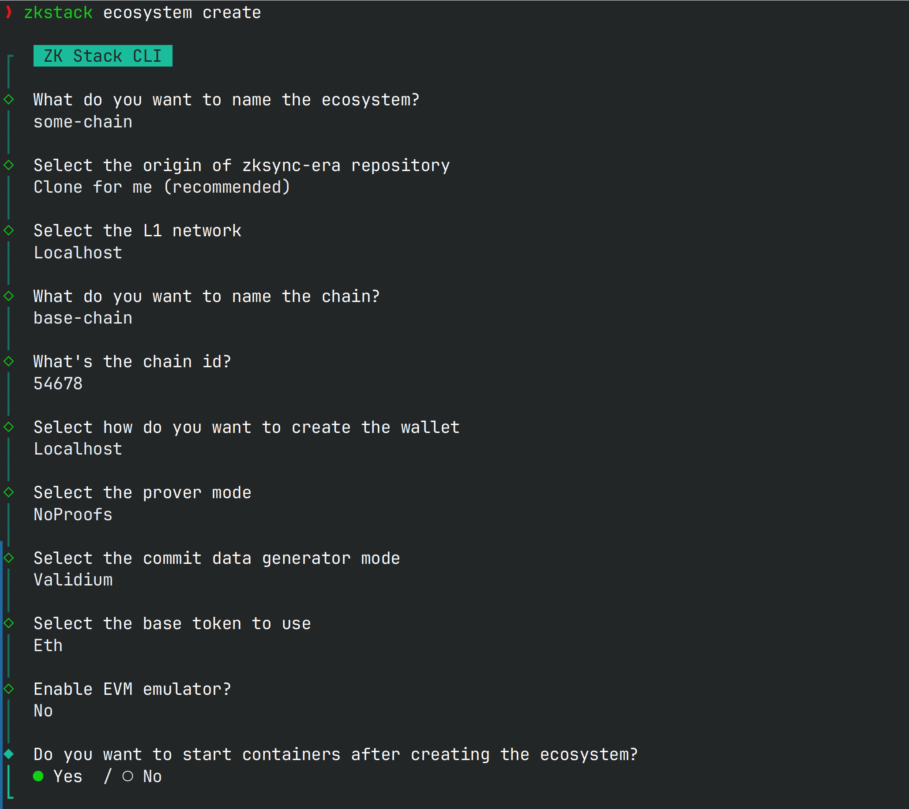
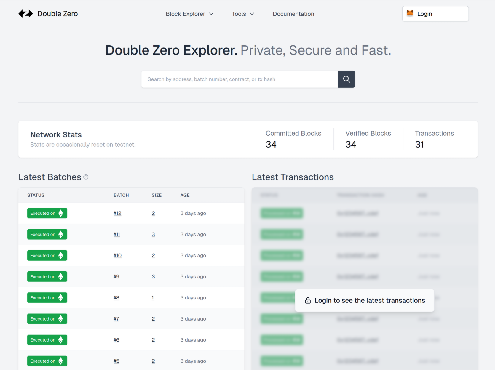
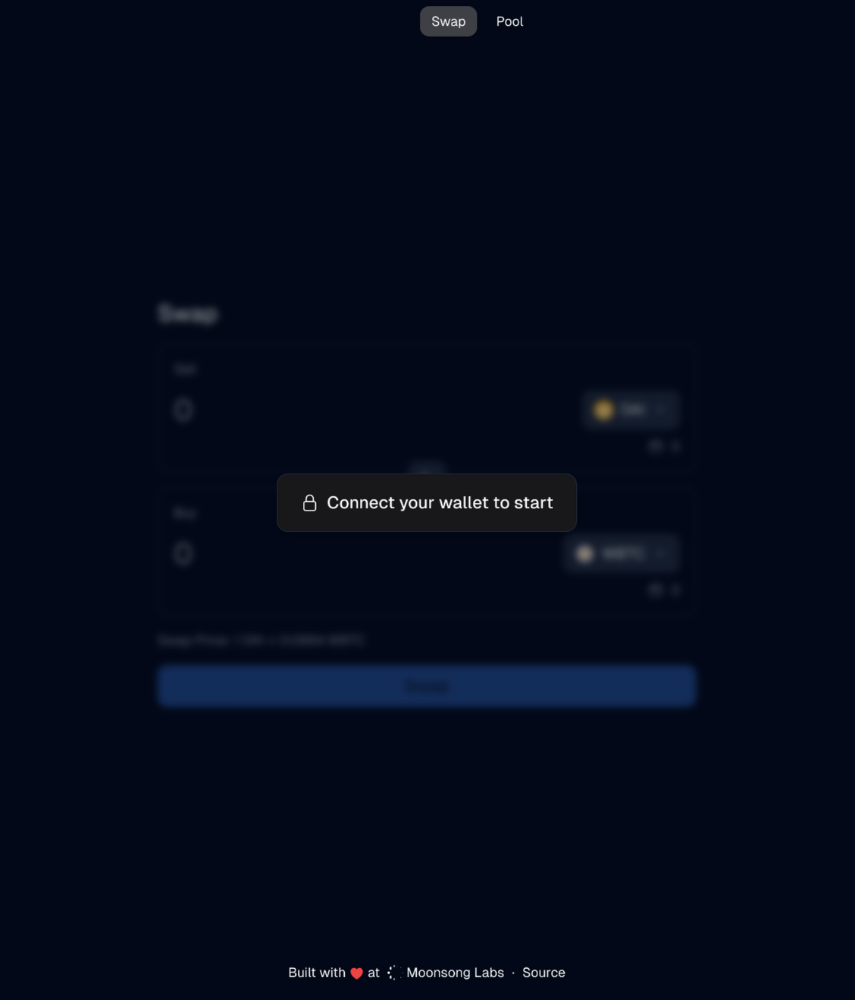

# Step-by-step full guide

Double Zero is a framework that provides privacy and access control for ZKsync-compatible chains.

This guide walks you through the complete process of setting up a local Double Zero environment, which includes a
private validium chain and a dapp built on the Double Zero framework.

## 1 - Deploy your validium chain

Our chain will be deployed using [zkstack](https://zkstack.io/). ZKstack enables you to create custom validium chains
tailored to your needs. For this guide, we'll use the basic deployment, but you can consult their documentation for more
customized configurations.

### 1.1 - Install rust

ZKstack requires Rust to be installed. The simplest way to install Rust is through Rustup. While you can use any
installation method you prefer, make sure you have an up-to-date version.

```bash
# rustup
curl --proto '=https' --tlsv1.2 -sSf https://sh.rustup.rs | sh

# stable rust
rustup install stable
```

### 1.2 - Install zksync foundry:

We need zksync foundry to deploy the contracts that we’ll be using. Foundry can be installed following this guide:

https://foundry-book.zksync.io/getting-started/installation

### 1.3 - Install docker

We are going to use docker in several parts of this guide. Please follow the instructions for your OS before
continue: https://docs.docker.com/engine/install/

### 1.4 - Install zkstack

Once rust is installed we can install `zkstack`. The easiest way to do this is installing `zkstackup` (a version manager
for zkstack) and then use that to install zkstack:

```bash
# Install zkstackup
curl -L https://raw.githubusercontent.com/matter-labs/zksync-era/main/zkstack_cli/zkstackup/install | bash

# Install zkstack
zkstackup
```

### 1.5 - Create a new ecosystem

Now that zkstack is installed we can use it to create our own validium chain. Zkstack has the concept of `ecosystems`
that are basically everything needed to have a chain running.

Ensure to have to following ports free:

- 5432
- 8545

Now we need to create the ecosystem. This command is going to promp you with a wizard to do the initial configuration
of the network. Double zero can work with any configuration, but the framework is meant to be used with a validium
chain. For the `Validium type`, feel free to select `NoDA`.

Also, it’s good to avoid using the default chain id. For this example we are going to use `271` .

```bash
zkstack ecosystem create
```



Once everything is set, you can start your chain:

```bash
cd <your_chain>

zkstack ecosystem init --dev

zkstack server run
```

This is going to run all the local chain components and expose an rpc in the port 3050.

### 1.6 - Start contract verifier

The contract verifier is used to check contract source code against deployed byte-code. This is going to be used in the
explorer to display the source code and ABIs of contracts.

You are going to be prompted about the versions of compilers that you want to support. Please choose solc at least
0.8.24 and zksolc at least 1.56. This is going to be used to verify contracts of our dapp.

In a new terminal run the following commands:

```bash
zkstack contract-verifier init

zkstack contract-verifier run
```

Once this is done you are going to have the verifier running in the port 3070.

### 1.7 Getting some funds

At this stage you might want to send some local ETH to an address that you control. That can be done like this:

Open another terminal and run the following command:

```bash
npx zksync-cli \
  bridge \
  deposit --rpc=http://localhost:3050 \
  --l1-rpc=http://localhost:8545
```

This is going to open a wizard. One of the default rich private keys is
`0x7726827caac94a7f9e1b160f7ea819f172f7b6f9d2a97f992c38edeab82d4110` , as the target you can use any address that you
control:

```bash
? Amount to deposit 111
? Private key of the sender 0x7726827caac94a7f9e1b160f7ea819f172f7b6f9d2a97f992c38edeab82d4110
? Recipient address on L2 <your_address>
```

After this is done you are going to have funds ready to use in your local validium chain.

## 2. Double Zero

Double Zero adds authentication and authorization on top of the newly created validium chain. All the services are
written in nodejs and they are meant to be easy to run and configure. Let’s go step by step.

### 2.1 - Clone the repo

Open a new terminal and run the following:

```bash
# clone repo
git clone git@github.com:Moonsong-Labs/double-zero.git
cd double-zero
```

### 2.2 Config

At this stage we need to link the private chain with double zero. We are going to run the double zero services inside a
docker a network. But they need to interact with our validium chain that is running in the host machine. The easiest way
to make this work is by connecting the validium chain using your local ip. You can use this commands to get your local
ip:

```bash
# linux
ip -4 addr show wlan0 | grep -oP ‘(?<=inet\s)\d+(\.\d+){3}’ | grep -Fv 127.0.0.1

# mac
ipconfig getifaddr en0

# windows
ipconfig
```

We are going to use your ip to link the validium rpc and the contract verifier.

Let’s go ahead end edit the file `environments/compose-hyperchain.env`. You should make it look this:

```bash
# Validium chain rpc
TARGET_RPC="http://<your-ip>:3050"
CONTRACT_VERIFICATION_API_URL="http://<your-ip>:3070"

# Conf
CORS_ORIGIN_PROXY="http://localhost:3010"
CORS_ORIGIN_RPC="*"
# Secret to encript block explorer cookie. In production this has to
# be a secure value.
SESSION_SECRET="0101010101010101010101010101010101010101010101010101010101010101"
# Secret used to communicate between proxy and private rpc. This
# has to be a secure value in productioon.
CREATE_TOKEN_SECRET="sososecret"

# App
APP_API_URL=http://localhost:4040
APP_BRIDGE_URL=http://localhost:3000/bridge
APP_HOSTNAMES=localhost
APP_ICON=/images/icons/zksync-arrows.svg
# Here you need to set your chain id
APP_L2_CHAIN_ID=271 # <-- your chain id.
APP_L2_NETWORK_NAME=Double Zero Local
APP_MAINTENANCE=false
APP_NAME=local
APP_PUBLISHED=true
APP_RPC_URL=http://localhost:4041
APP_BASE_TOKEN_ADDRESS=0x000000000000000000000000000000000000800A
```

Once the configuration is in place you can run the double zero services.

### 2.3 - Launch

```bash
./environments/launch-hyperchain-env-a.sh
```

after chain A infrastructure was started, start chain B infra from another terminal:

```bash
./environments/launch-hyperchain-env-b.sh
```

This is going to run all the services of double zero using docker. At this stage you can check that the explorer is
working going with your browser to [http://localhost:3010](http://localhost:3010)



Once you check that stop the process doing `CTRL-C`. We still need to configure the access to our dapp before continue.

## 3 - Deploy dapp

We are going to use an example dapp to integrate the entire stack. The dapp is a really simple constant product amm that
can be used to make swaps between 2 tokens. Let’s start:

### 3.1 - Clone the repo

In a new terminal:

```bash
git clone git@github.com:Moonsong-Labs/double-zero-dapp.git
cd double-zero-dapp
git submodule update --init --recursive
```

### 3.2 - Deploy the contracts

The repo includes a script to deploy all the needed contracts together. We are going to fund the deployment with the
funds that you got on point `1.7` , so you are going to need the private key of that address.

The following commands deploy the scripts:

```bash
export PREMIUM_USER_ADDRESS="some_address" # address that you control (for Chain A)
export BASIC_USER_ADDRESS="some_address" # second address that you control (for Chain B)

cd contracts
./scripts/deploy.sh
```
At the end of the process you'll see multiple contract addresses.
Take note of them, they are going to be used in the next step.

After running this script:

- The contracts are deployed.
- The deployer was registered as a VIP user and PREMIUM_USER_ADDRESS as a premium user.
- PREMIUM_USER_ADDRESS received test tokens on Chain A. BASIC_USER_ADDRESS received test tokens on Chain B.

### 3.3 - Configure double zero permissions

Let’s go back to the double zero repo. We have to edit this file: `environments/compose-hyperchain-permissions-a.yaml` and `environments/compose-hyperchain-permissions-b.yaml`

This files define the access for permissions for each contract. This is what we are going to do

```bash
groups:
  - name: admins
    members:
      - "<your address>" # <-- EDIT HERE
contracts:
  # CPAMM
  - address: "<cpamm_address>" # <-- EDIT HERE
    methods:
      #...
  # TradeEscrow.sol
  - address: "<trade_escrow_address>" # <-- EDIT HERE
    methods:
      #...
  # USDG
  - address: "<usdg_address>" # <-- EDIT HERE
    methods:
      # ...
  # wAAPL
  - address: "<waapl_address>" # <-- EDIT HERE
    methods:
      # ...
```

Now you can run all the double zero services for both chains, this time we are going to leave them up:

```bash
./environments/launch-hyperchain-env-a.sh
```

after chain A infrastructure was started, start chain B infra from another terminal:

```bash
./environments/launch-hyperchain-env-b.sh
```

### 3.4 - Configure and run dapp frontend

In a new termnal, go to the root of the dapp and run the following command:

```bash
cd web
cp .env.example .env
```

Now edit the .env file by filling missing contract addresses.

### 3.5 - Run the frontend of the dapp

The dapp front end needs pnpm to be executed. You can follow their instructions to get
it: [https://pnpm.io/installation](https://pnpm.io/installation)

Once pnpm is installed you can go ahead and start the dapp frontend:

```bash
pnpm install
pnpm dev
```

Now, you can go to [localhost:3000](http://localhost:3000) to see your dapp running.



You can connect your metamask wallet to the double zero rpc through the explorer. And then you can use the app.